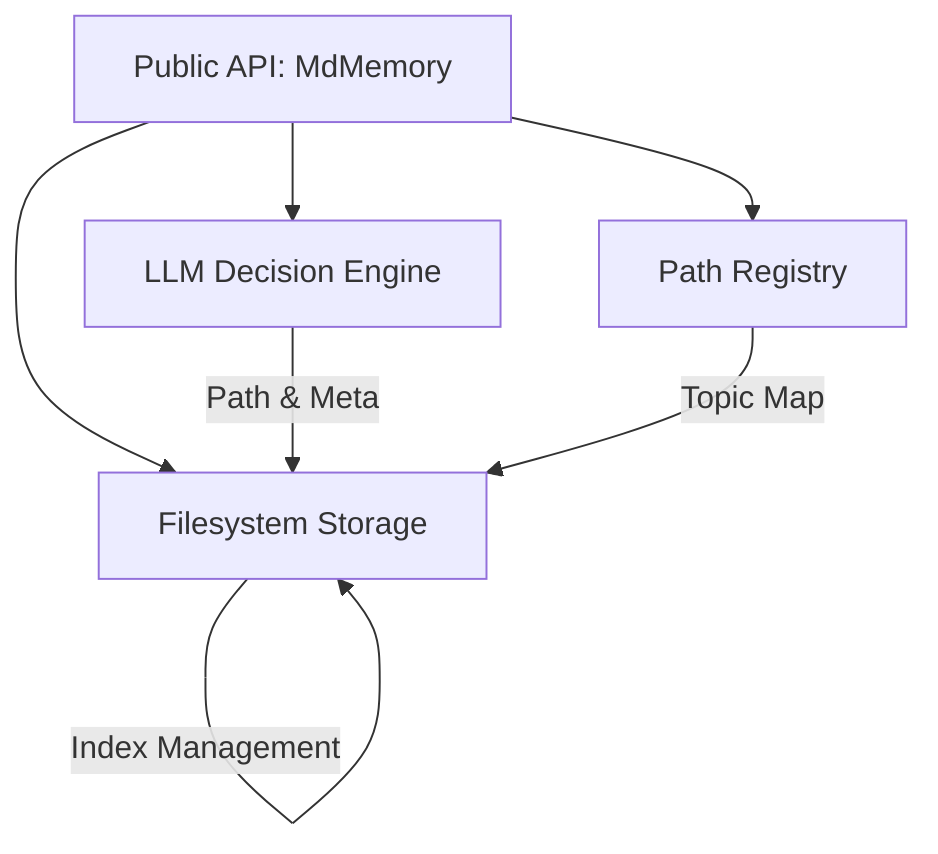

# MdMemory Technical Design

## 1. System Architecture
MdMemory uses a filesystem-based storage engine with an in-memory registry and asynchronous I/O.

### 1.1 Data Flow Diagram


## 2. Component Design

### 2.1 Core Module (`core.py`)
The `MdMemory` class is fully asynchronous.
- **`store()`**: 
    1. Sends content to `LiteLLM` (Async).
    2. Parses JSON response for `recommended_path` and `frontmatter`.
    3. Writes file using `utils.write_markdown_file` with mandatory locking.
    4. Updates `PathRegistry`.
- **`optimize()`**:
    1. **Sliding Window**: Processes user topics in batches (default: 50) to stay within LLM token limits.
    2. Filters topics by `user_id`.
    3. Executes `shutil.move` and updates registry.
- **`search()`**:
    1. Performs keyword intersection across topic ID, summary, and tags.
    2. Filters by `user_id` before reading metadata.

### 2.2 Registry Module (`registry.py`)
The `PathRegistry` class manages `.registry.json` asynchronously.
- **Locking**: Uses `portalocker` via `asyncio.to_thread` for all write operations.
- **Storage Strategy**: A simple JSON dictionary `{ "topic_id": "relative/path.md" }`.

### 2.3 Utility Module (`utils.py`)
- **Async I/O**: Uses `aiofiles` for all file reads/writes.
- **Safe Fallback**: `generate_fallback_topic()` creates unique IDs using MD5 hashes when LLM generation fails.

### 2.4 MCP Module (`mcp.py`)
Provides the Model Context Protocol server interface.
- **Transport Layer**: Configurable between `stdio` and `SSE` (using `FastAPI` and `starlette`).
- **Tool Mapping**:
    - `store_memory` -> `MdMemory.store()`
    - `search_memory` -> `MdMemory.search()`
    - `get_topic` -> `MdMemory.get()`
    - `delete_topic` -> `MdMemory.delete()`
- **Resource Scheme**:
    - `mdmemory://index`: Returns the root knowledge tree.
    - `mdmemory://topic/{topic_id}`: Returns the full content of a specific topic.
- **Prompts**:
    - `summarize_knowledge`: Templates for summarizing all topics under a category.
- **Identity Management**: `usr_id` is bound at server startup, ensuring the AI agent only sees the authorized user's memory.

## 3. Data Schema

### 3.1 FrontMatter (YAML)
```yaml
topic: coding_python_decorators
summary: An overview of how decorators work in Python.
tags: [python, coding, tutorial]
user_id: user_123
created_at: 2024-04-29T10:00:00
updated_at: 2024-04-29T10:05:00
```

### 3.2 Registry (JSON)
```json
{
  "coding_python_decorators": "categories/coding/python_decorators.md"
}
```

## 4. Key Implementation Details

### 4.1 Recursive Index Management
When a topic is added, moved, or deleted:
1. The system identifies the target folder.
2. **Recursive Pruning**: Walks up the directory tree from the topic's parent to the root.
3. Updates `index.md` at each level to ensure consistency.

### 4.2 Index Compression Logic
Triggered during `optimize()`:
1. `os.walk` scans for directories containing `index.md`.
2. If a folder contains 3+ files, its entries in the *parent* index are replaced with a single folder link.

### 4.3 LLM Prompting
Uses a structured prompt that includes the `optimize_threshold` to guide the Librarian's decisions. Extraction uses greedy Regex `\{.*\}` to handle LLM verbosity.

## 5. Data Integrity & Concurrency
- **Mandatory Locking**: All critical file updates (Registry, Indices) use `portalocker.lock` on the file descriptor.
- **Async Safety**: Blocking locking operations are offloaded to threads using `asyncio.to_thread` to maintain event loop responsiveness.
